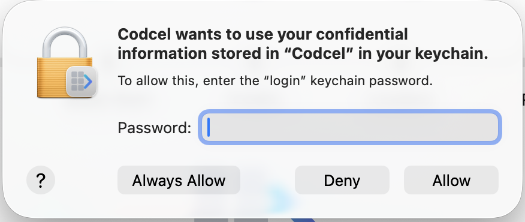

# Codcel Desktop — Downloads

Turn Excel into real code in minutes.

Codcel Desktop is the application for **Codcel**, the platform that converts Excel spreadsheets into production-ready code in multiple languages — including Rust, Python, Java, C#, JavaScript/TypeScript, Go, Swift, and more.  

Learn more at 👉 https://codcel.io

This repository hosts the **official binary releases** of Codcel Desktop for macOS, Windows, and Linux.

---

## 🚀 Latest Downloads

### Windows
- 👉 [Download x64](https://github.com/codcel-io/codcel-app/releases/tag/release-0.1.5)

### macOS
- 👉 [Download for Apple Silicon (M1/M2/M3/M4..)](https://github.com/codcel-io/codcel-app/releases/tag/release-0.1.5)
- 👉 [Download for Intel](https://github.com/codcel-io/codcel-app/releases/tag/release-0.1.5)

### Linux
Linux builds are coming soon.

---

## 🚀 Quick Start

1. Download Codcel Desktop  
2. Open the application  
3. Load your Excel file  
4. Click “Generate”  

Your code is ready in seconds.

---

## 📦 About This Repository

This repository contains **only the official Codcel Desktop binaries**.

For source code and other components, see:
👉 https://github.com/codcel-io

---

## About Codcel

Codcel instantly transforms complex Excel spreadsheets into clean, maintainable source code and fully functional application scaffolds.  

It is designed for developers, analysts, financial modelers, and organisations that rely on Excel for business-critical logic and want to migrate that logic into real software systems.

Codcel generates:

- Calculation libraries  
- REST APIs  
- MCP servers  
- UI scaffolds  
- Documentation  
- Infrastructure templates  

—all from your Excel workbook.

---

# Installation Instructions

## macOS

Depending on your security settings, macOS may block the application because it is not yet notarized.

### macOS Installation Steps

1. Download the appropriate `.dmg` file (Apple Silicon or Intel).
2. Open the `.dmg` and drag **Codcel Desktop.app** to **Applications**.
3. If macOS shows a warning:  
   “Codcel Desktop can’t be opened because Apple cannot check it for malicious software.”

   Do this:
   1. Open **System Settings → Privacy & Security**  
   2. Scroll down to “Security”  
   3. Click **Allow Anyway**
   4. Now right-click **Codcel Desktop.app** → **Open**
   5. Confirm “Open” when prompted

After this, macOS will trust the app and you can launch it normally.

### Keychain Access Prompt on Updates

Codcel Desktop securely stores your login credentials in the macOS Keychain — the same built-in system that Safari, Mail, and other macOS apps use to keep your passwords safe. The keychain entry is named **"Codcel"**.

When you install a new version of Codcel Desktop, macOS may ask you to re-authorize the app to access your saved login credentials. This is standard macOS security behavior — it happens because each new build has a slightly different code signature, so macOS confirms that you're happy for the updated app to read your stored credentials.

You'll see a prompt like this:


Simply enter your Mac login password and click **Always Allow**. You may see the prompt a second time — just repeat the same steps:



After that, Codcel Desktop will work normally without any further prompts until the next update.

> **Note:** Once Codcel Desktop is signed with an Apple Developer certificate, this keychain prompt will no longer appear on updates. Until then, this is simply macOS doing its job — keeping your credentials protected and making sure you consent before any app accesses them.

---

## Windows (x64)

Windows SmartScreen may show a warning if the application is not signed.

### Windows Installation Steps

1. Download the `.exe` installer.
2. Double-click to run it.
3. If Windows shows a SmartScreen warning:
   - Click **More info**
   - Then click **Run anyway**

Codcel Desktop will install and can be launched from the Start Menu.

---

## Linux (x86_64)

Linux distributions vary, but AppImage is broadly supported.

### Linux Installation Steps

1. Download the `.AppImage` file.
2. Make it executable:

```bash
chmod +x Codcel-Desktop-Linux-x86_64.AppImage
```

3. Run it:

```bash
./Codcel-Desktop-Linux-x86_64.AppImage
```

Some desktop environments may prompt you to trust the file on first launch.

---

## Policies & Terms

Before using Codcel Desktop or any generated code, please review our:

- Terms of Service  
- Privacy Policy  
- Cookie Policy  

These are available at 👉 https://codcel.io
